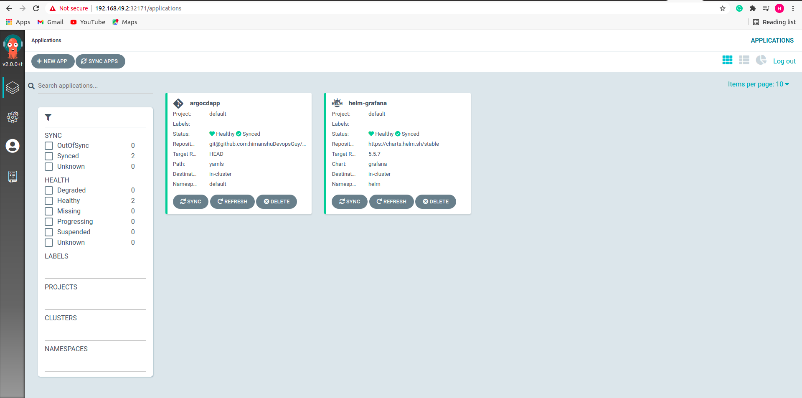

# Metadata

- ## [ArgoCD Intro](#ArgoCD-Introduction)

- ## [Why we need ArgoCD](#Why-ArgoCD)

- ## [Features](#Features-of-ArgoCD)

- ## [Architecture](#Architecture-and-components-of-Argocd)

- ## [Prerequisite and Installation of Argocd](#Prerequisite) 
    - ## [For Minikube](#ArgoCD-Installation-inside-minikube)

- ## [Argocd-cli ](#ArgoCD-CLI-Installation)

- ## [ArgoCD StartOff](#Getting-Started)

- ## [References](#Reference)

### ArgoCD Introduction

Argo CD is implemented as a Kubernetes CRD which continuously monitors running applications and compares the current, live state against the desired target state (as specified in the git repo). A deployed application whose live state deviates from its target state is considered out-of-sync. Argo CD reports & visualizes any deviation as well as provides mechanisms to automatically or manually sync the live state to the desired target state. Any modifications made to the desired target state in the git repo can be automatically applied and reflected in the specified target environments.

You can get started in 2 easy steps:
- Define your App and environment configs in a Git repo
- Argo monitors and syncs your app between Git config and the Kubernetes cluster using any pipeline (Argo CI, Jenkins, etc.), CLI or UI.

#### Pull or push?

There are a couple of different ways of doing declarative continuous delivery. Pull model is where the CD system (Argo CD) continuously monitors and updates the application’s state on the Kubernetes cluster to the target state defined in Git. In the push model, a user initiates the update from an external system using a CI pipeline.
Argo CD supports both the pull and the push-based GitOps model to sync target environments with desired application state. At Intuit, we follow the push model and invoke Argo CD from a CD pipeline (Jenkins) for security and compliance reasons.

### Why ArgoCD

- ArgoCD is solely developed to work on k8s
- spinnaker is complex, slow and too heavy weight as compared to argocd.
- You can use both the UI and the Argo CD CLI tool to manage your applications with Argo CD.
- There are Kubernetes manifests that describe your app in a Git repository. The very same manifests are applied to your Kubernetes cluster, which satisfies the principle of infrastructure as code.
    - Argo CD makes sure these manifests are always in sync. If a change gets merged to your master branch, the application is marked “OutOfSync”.
- You may have noticed that the Argo CD approach does not involve any kind of CI, meaning there is no test or build step when syncing. 
    - This means that if you want a fully-fledged CI/CD pipeline using Argo CD, you need to combine it with other tools like Jenkins, Travis, Circle CI or Gitlab CI. 
    - You’d separate the application repository from your manifest repository. 
    - Changes to the app repo’s master would trigger your CI, testing and building the new container image. 
    - As a final step of CI, an automated commit would update the image version in the manifest repo, notifying Argo CD of the change.


### Features of ArgoCD
- Syncing of applications to its desired state as defined in Git using variety of configuration management tools such as ksonnet/jsonnet, Helm and kustomize.
- Automated deployment of applications to specified target environments.
- Continuous monitoring of deployed applications.
- Web and CLI based visualization of applications and differences between current and target state.
- Rollback/Roll-anywhere to any application state committed in the git repository.
- PreSync, Sync, PostSync hooks to support complex application rollouts (e.g.blue/green & canary upgrades).
- SSO Integration (OIDC, LDAP, SAML 2.0, GitLab, Microsoft, LinkedIn).
- Webhook integration (GitHub, BitBucket, GitLab).
- Can be used standalone or as part of an existing pipeline tools such as Argo Workflow, Jenkins, etc.


### Architecture and components of Argocd
- argocd-server
- repo-server
- app-controller
- redis-server
- dex-server

### Prerequisite
- Knowledge of k8s is required:

### ArgoCD Installation inside minikube

Argocd can be installed with simple steps:

> **NOTE :** to install argocd make sure that your minikube cluster is up and running, if not open the terminal and type `$ minikube start`


- creating a namespace

```
$ kubectl create ns argocd
```

- Apply install.yaml file which is reponsible to install all the resources needed for argocd.

```
$ kubectl apply -n argocd -f https://raw.githubusercontent.com/argoproj/argo-cd/stable/manifests/install.yaml
```
- See in the below picture that we a minkube cluster and we just deployed argocd resources inside argocd namespace.


### ArgoCD CLI Installation

- Fetching Version

```
$ VERSION=$(curl --silent "https://api.github.com/repos/argoproj/argo-cd/releases/latest" | grep '"tag_name"' | sed -E 's/.*"([^"]+)".*/\1/')
```

- Download argocd binary

```
$ sudo curl -sSL -o /usr/local/bin/argocd https://github.com/argoproj/argo-cd/releases/download/$VERSION/argocd-linux-amd64
```

- Making the binary executable

```
sudo chmod +x /usr/local/bin/argocd
```

### Getting Started

>Now your Argocd and argocd-cli is successfully installed so let's get started.

- To interact with the argocd UI. First you need to change the argocd-server clusterIP service to NodePort.

```
$ kubectl patch svc argocd-server -n argocd -p '{"spec": {"type": "NodePort"}}'
```

- Now you can interact with the argocd web ui simply go to google chrome type minikube ip with Nodeport in the console and hit enter.
For eg:
```
192.168.49.2:32171
```


- Now if you see the above image it requires Username and password to login 
    - by default the username is `admin`
    - password you can get from the command
        - `kubectl -n argocd get secrets argocd-initial-admin-secret --template={{.data.password}} | base64 -d`

- login to the argocd ui using the admin username and password as generated above, you will see the below screen.  


### Integrating with github  

- click on the settings icon from the left side and then click on Repositories.


- Inside Repositories you can see various options to connect, click on any of the option which you prefer and setup integration with your github or you can use mine for learning purpose.


    
    
- Once the connection status is successful, Now its time create the application, Click on manage your applications from the left and then click on create app.


- fill the details and enable autosync and then  click on create



- Then you will see your application in the UI, Click on the application(eg: argocdapp) and there you will see a proper diagramatic view of the resources that are deployed.


- You can check the deployments inside minikube cluster through :
```
kubectl get all
```
or you can also check in the web UI using minikube:Nodeport of the application.


### Reference

- https://argoproj.github.io/argo-cd/
- https://github.com/argoproj/argo-cd/
